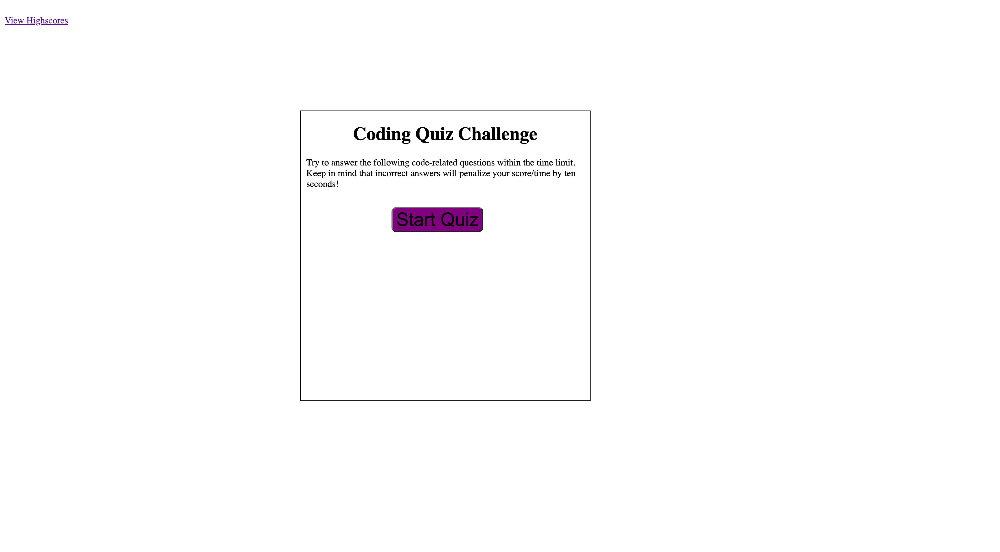
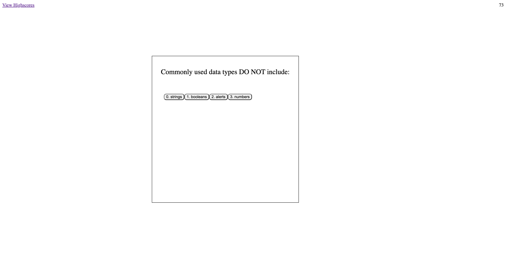
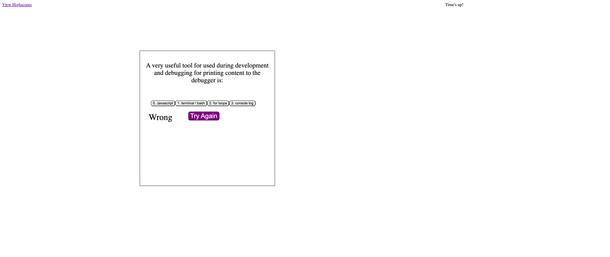
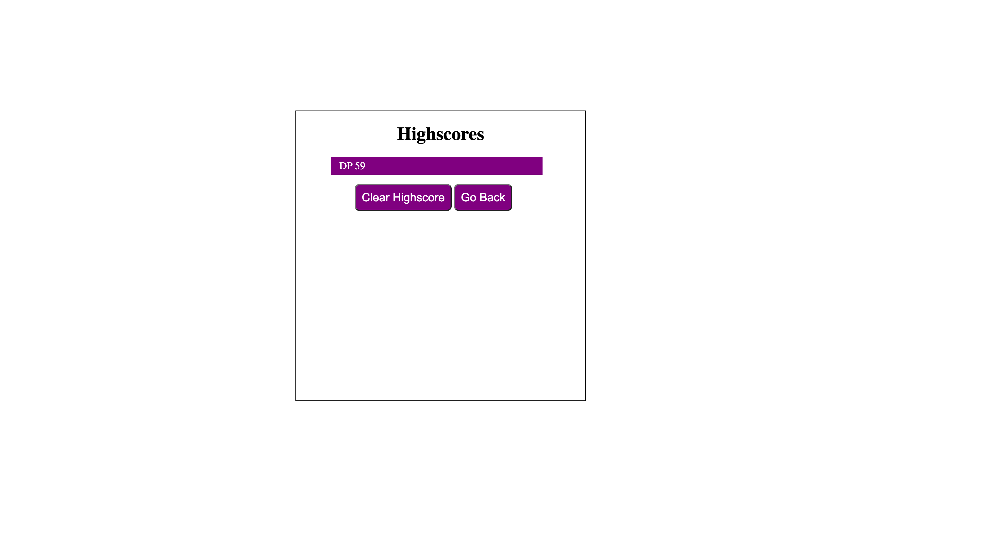

# Code-Quiz

This is a quiz application using HTML, CSS, and Javascript. This application emphasizes the use of Javascript to provide quiz questions and collect user data to determine whether the answers to a question are correct, this then generates a score and appends a final page of results from the user data. 

This project has been deployed to GitHub Pages. To get this project up and running, you can follow the deployment link. Or, download the sources files to use this as a template.

* [GitHub Repository](https://github.com/djpdim/Code-Quiz)
* [Deployed GitHub IO](https://djpdim.github.io/Code-Quiz/)

### Summary
* HTML and CSS and Javascript documents create a quiz with multiple choice questions with Javascript trivia
* This project emphasizes the use of using Javascript to make dynamic changes to an HMTL document
* This project utilizes the use of appending HTML pages 

### This project has the following features: 
* A Start Quiz button: 
    * This starts a timer for the user.
    * Each question averages 15 seconds each for a total time of 75 seconds. 
    * If questions are answered incorrectly, 10 seconds are deducted off remaining time.
    * Answers are recording using an event listener, "click" and tracks correct answers.
    * Final score which is calculated using time remaining.
    * Input area to record initials.
    * A Submit button.
    * Submit buttom saves initials and score to local storage.

* A Highscores HTML:
    * This a list summary of intials and final scores.
    * Clear button resets the page and local storage.
    * Go back button travels to the start of the quiz.

* A Try Again button:
    * This will show when the time is up so user will reload the Quiz and start again from the beggining.

### Psuedo code:  
* When start quiz, start countdown 
* Start Quiz will be on appended page
* Append the question: choices
* When user selects the right answer, textcontent "Correct!"
* When user selects the right answer, textcontent "Wrong!"

* Captures local storage
* Travels to another HTML
* Retrieved highscores

### This project has media Queries for:
* max-width: 980px 
    * Adjusts body and container width
* max-width: 786px
    * Adjusts body and container width
    * Adjusts buttons
* max-width: 640px
    * Adjusts body and container width
    * Adjusts buttons to be centered and stacked

## Acknowledgments

* Work along with Tutor Michelle and TA Andrew to bring everything in order to work.

